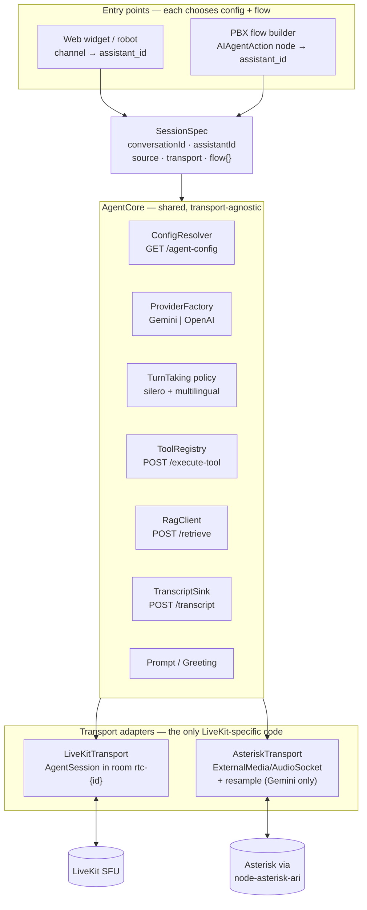
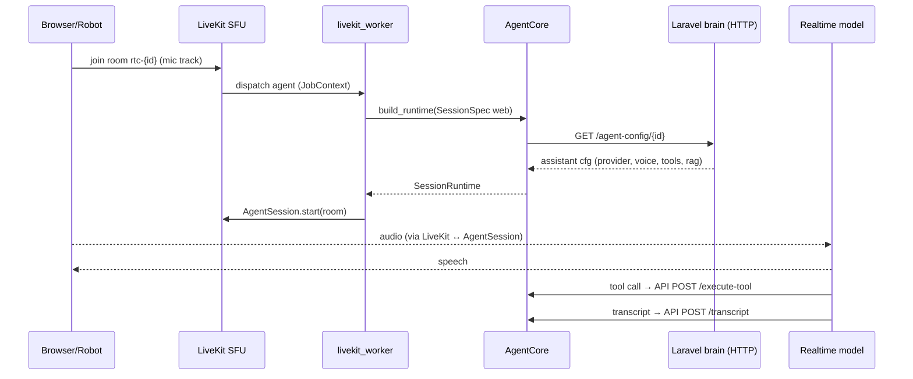
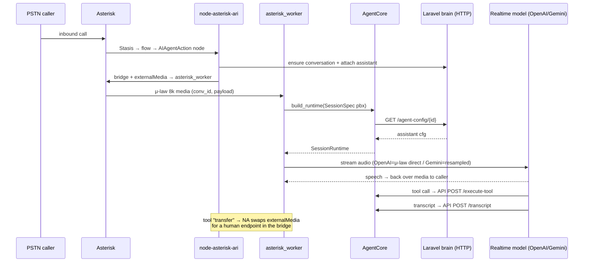

# 11 — Unified Agent: one codebase, two transports

The concrete version of the "shared core" / Direction 3 idea ([[09-standalone-agent-no-livekit#The elegant middle path]], [[06-comparison-and-decision]]): **refactor `docker-rtc/voice-agent` so the same code powers the WebRTC agent *and* the phone agent**, with each call choosing its own **config** (which assistant) and **flow** (how it was routed / how it should behave). See [[00-index]], engine choice in [[10-realtime-providers]], turn-taking in [[07-vad-and-turn-taking]].

---

## Goal & guiding principle

Today `agent.py` is one monolith welded to LiveKit: it assumes a room, an `AgentSession`, and a Gemini model. We want to keep that working for web/robot **and** add a phone path **without forking the AI** — and without maintaining two divergent agents.

The principle is the one this whole vault keeps returning to: **brain vs ears.** The brain (config, RAG, tools, transcripts, prompt, turn-taking *policy*, provider selection) is identical for every caller. Only the **ears** — how audio arrives and leaves — differ between a browser (LiveKit room) and a phone (Asterisk media). So we factor the monolith into a **transport-agnostic `AgentCore`** plus **thin transport adapters**.



---

## What "choose the config and flow" means

Every entry point — web, robot, or a PBX `AIAgentAction` node — collapses into **one value object** the core consumes identically:

```python
@dataclass
class SessionSpec:
    conversation_id: str          # → room rtc-{id} OR media stream key
    assistant_id: str | None      # the CONFIG: prompt/voice/model/tools/RAG (None = resolve from conversation)
    source: str                   # "web" | "robot" | "pbx"
    transport: str                # "livekit" | "asterisk"
    flow: dict                    # the FLOW context:
                                  #   { node_id?, fallback_queue?, greeting?, language?, max_duration_sec? }
```

- **Config** = `assistant_id` → resolved by `ConfigResolver` into the full `AssistantConfig` (system instruction, voice, **provider+model**, tools, RAG). Identical resolution for both transports — it's just `GET /v1/internal/rtc/agent-config/{conversationId}` ([[01-current-architecture#4. The AI "brain" — assistant model & internal contract (verified)]]).
- **Flow** = how the call got here and what to do at the edges: which PBX node invoked it, the fallback queue to escalate to, a greeting override, the language, a max duration. Web sessions pass a minimal flow; PBX sessions pass the node's payload.

The result: a web call and a phone call differ in **two fields** (`source`, `transport`) and a few `flow` hints — everything downstream is shared.

---

## Target module layout (refactor of `docker-rtc/voice-agent`)

```
voice-agent/
├── core/
│   ├── session_spec.py      # SessionSpec, AssistantConfig dataclasses
│   ├── config_resolver.py   # agent-config → AssistantConfig  (shared)
│   ├── provider_factory.py  # build Gemini OR OpenAI realtime model from config
│   ├── turn_taking.py       # silero + MultilingualModel policy (params, not engine)
│   ├── tools.py             # dynamic tool registry → execute-tool  (shared)
│   ├── rag.py               # retrieve client  (shared)
│   ├── transcripts.py       # transcript sink  (shared)
│   ├── prompt.py            # system instruction + greeting policy  (shared)
│   └── agent_core.py        # AgentCore.build_runtime(spec) -> SessionRuntime
├── transports/
│   ├── base.py              # Transport ABC: async run(runtime)
│   ├── livekit_transport.py # AgentSession in a room (web/robot)
│   └── asterisk_transport.py# ExternalMedia/AudioSocket loop (phone)
├── audio/
│   ├── resampler.py         # 8k ↔ 16k/24k (asterisk + Gemini only)
│   ├── audiosocket.py       # AudioSocket framing
│   ├── rtp.py               # ExternalMedia RTP
│   └── noise.py             # RNNoise (today's audio_filter.py)
└── entrypoints/
    ├── livekit_worker.py    # AgentServer @rtc_session → SessionSpec → core+LiveKitTransport
    └── asterisk_worker.py   # TCP/RTP listener → SessionSpec → core+AsteriskTransport
```

`core/` and most of `audio/` are **shared and transport-blind**. The only LiveKit-aware file is `livekit_transport.py` (+ its entrypoint); the only Asterisk-aware file is `asterisk_transport.py` (+ its entrypoint).

---

## The honest seam: what is truly shared vs transport-specific

This is the crux, and pretending otherwise would mislead. **`AgentSession` (from `livekit-agents`) is itself the orchestration engine** — it bundles VAD, turn detection, interruption, and audio playback, and it *requires a LiveKit room*. The Asterisk path has no room, so it **cannot reuse `AgentSession`**. Therefore:

| Concern | Shared in `core/`? | Notes |
|---|---|---|
| Config resolution, provider/model build | ✅ fully | one `ConfigResolver` + `ProviderFactory` |
| Tools (definitions + dispatch), RAG, transcripts, prompt/greeting | ✅ fully | plain HTTP glue, no transport in it |
| Turn-taking **parameters** (silero thresholds, multilingual model) | ✅ as config | applied differently per transport (below) |
| The **orchestration loop** (drive model, schedule playback, barge-in) | ⚠️ partly | LiveKit uses `AgentSession`; Asterisk needs its own |

So two refactor options, trading effort for completeness of sharing:

### Option A — keep `AgentSession` for LiveKit, thin custom loop for Asterisk (recommended start)
- **LiveKit transport:** `AgentSession(llm=runtime.model, vad=runtime.vad, turn_detection=runtime.turn).start(room)` — essentially today's code.
- **Asterisk transport:** a small custom loop. **If the phone path uses OpenAI Realtime**, this loop is *thin* — the provider does VAD, turn detection, and interruption server-side ([[10-realtime-providers]]); you mostly pump μ-law frames in and play audio out, reacting to `speech_started`/`interrupted` events. **If it uses Gemini**, the loop must add resampling + run silero + the turn detector itself.
- Sharing: everything except the loop. ~80% shared. Lowest risk.

### Option B — one custom orchestration loop for both (max sharing, more work)
- Drop `AgentSession`; write a single `core/orchestrator.py` that both transports feed via an audio-source/sink interface. Re-implements interruption + playback scheduling once, used everywhere.
- Sharing: ~100%, including the loop. But you give up what `livekit-agents` gives free and must re-test turn-taking/barge-in on the web path too. Best end-state if telephony is strategic and you want a single behavior surface.

> Pragmatic path: **ship Option A**, and only graduate to Option B if maintaining two loops becomes painful. OpenAI-on-phone keeps Option A's second loop small enough that B may never be worth it.

---

## Core interface (sketch)

```python
class AgentCore:
    def __init__(self, http):                  # shared clients (config, rag, tools, transcripts)
        self.config   = ConfigResolver(http)
        self.provider = ProviderFactory()
        self.tools    = ToolRegistry(http)
        self.rag      = RagClient(http)
        self.tx       = TranscriptSink(http)

    async def build_runtime(self, spec: SessionSpec) -> "SessionRuntime":
        cfg     = await self.config.fetch(spec.conversation_id)        # AssistantConfig (provider-agnostic)
        model   = self.provider.create(cfg)                            # gemini.RealtimeModel | openai.RealtimeModel
        tools   = self.tools.build(cfg, spec)                          # dynamic + telephony (transfer/hangup)
        turn    = TurnTaking.from_config(cfg, spec.flow)               # silero + multilingual params
        greet   = Greeting.for_flow(cfg, spec.flow)                    # source/flow-aware first utterance
        return SessionRuntime(cfg, model, tools, turn, self.rag, self.tx, greet, spec)
```

```python
class Transport(ABC):
    @abstractmethod
    async def run(self, rt: "SessionRuntime") -> None: ...

# entrypoints/livekit_worker.py
@server.rtc_session(agent_name=AGENT_NAME)
async def entrypoint(ctx):
    conv = ctx.room.name.removeprefix("rtc-")
    spec = SessionSpec(conv, assistant_id=None, source="web",
                       transport="livekit", flow={})
    rt = await core.build_runtime(spec)
    await LiveKitTransport(ctx).run(rt)

# entrypoints/asterisk_worker.py  (called per call by node-asterisk-ari)
async def on_call(stream, conv_id, payload):
    spec = SessionSpec(conv_id, assistant_id=payload["assistant_id"], source="pbx",
                       transport="asterisk", flow=payload)        # payload = the AIAgentAction node config
    rt = await core.build_runtime(spec)
    await AsteriskTransport(stream).run(rt)
```

Both entrypoints build the *same* `SessionRuntime` from the *same* core; only the transport differs.

---

## Sequence: a web call (unchanged behavior, new structure)



## Sequence: a PBX call (new path, same core)



Notice both sequences are **identical from `build_runtime` onward** — the brain calls (`agent-config`, `execute-tool`, `transcript`) are byte-for-byte the same. Only the first three messages (how audio arrives) differ.

---

## Provider × transport (why OpenAI simplifies the phone ear)

| | LiveKit transport | Asterisk transport |
|---|---|---|
| **Gemini** | today's path; LiveKit transcodes + AgentSession orchestrates | gateway resamples 8k↔16k/24k **and** runs silero + turn detector |
| **OpenAI** | works via AgentSession (openai plugin) | **native μ-law + server/semantic VAD** ⇒ thin loop, no resampling, no detector to port |

The cell that makes Option A cheap is **OpenAI on Asterisk** ([[10-realtime-providers]]). Keep `ProviderFactory` driven by the assistant's `AiIntegration`, and the same config that says "this assistant uses Gemini" or "…OpenAI" picks the engine per call — web and phone can even use *different* providers if that's optimal (e.g. Gemini for web cost, OpenAI for phone quality).

---

## Refactor in phases (keep web working throughout)

1. **Extract core, no behavior change.** Move config/tools/RAG/transcripts/prompt out of `agent.py` into `core/`; make today's LiveKit path call `core.build_runtime` + `LiveKitTransport`. Ship — web/robot unchanged, now structured. *(Pure refactor; fully testable against current web calls.)*
2. **Add `ProviderFactory`.** Abstract Gemini behind it (still Gemini for web). Make `agent-config` provider-agnostic on the PHP side ([[10-realtime-providers]]).
3. **Build `AsteriskTransport` (Option A).** ExternalMedia/AudioSocket loop; start with **OpenAI** to keep it thin. Wire `asterisk_worker` to node-asterisk-ari's `AIAgentAction` ([[05-implementation-plan]] / [[09-standalone-agent-no-livekit]]).
4. **Telephony tools + escalation, greeting/barge-in tuning for 8 kHz.**
5. **(Optional) Option B** — unify the loop if two loops prove costly.

---

## Trade-offs

| ✅ | ⚠️ |
|---|---|
| One brain, one place to improve prompts/tools/RAG for all channels | Upfront refactor before any phone value ships |
| Web and phone can pick provider/voice/model per call | The orchestration **loop** can't be fully shared unless you do Option B |
| Phone keeps native ARI escalation + recording (no LiveKit needed) | Two transports = two media code paths to test (LiveKit vs RTP/AudioSocket) |
| Georgian turn-taking tuned once, reused (esp. with OpenAI semantic VAD) | Provider-agnostic `agent-config` is a prerequisite change |
| Clean migration: step 1 is a no-behavior-change refactor | Asterisk-Gemini cell still needs resampling + detector if you avoid OpenAI |

**Bottom line:** this is the architecture to land if voice is strategic across web *and* phone. Start with the no-behavior-change extraction (phase 1), choose **OpenAI for the phone ear** to keep the second loop thin, and you converge on a single agent that any transport — and any future channel — can plug into. It is [[09-standalone-agent-no-livekit|Direction 2]] and [[05-implementation-plan|Direction 1]] reconciled: the brain is shared, the ears are pluggable, and LiveKit becomes *optional* rather than load-bearing.
