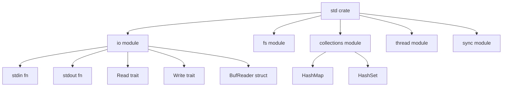

# The Standard Library (`std`)

The **standard library** is Rust's built-in toolbox. It is technically a crate named `std` that ships with the compiler, and it is split into many **modules** that group related functionality.

## What's inside `std`?

| Module             | What it gives you                                    | Example                         |
| ------------------ | ---------------------------------------------------- | ------------------------------- |
| `std::io`          | Input/output: stdin, stdout, files, readers, writers | `io::stdin()`, `io::BufReader`  |
| `std::fs`          | Filesystem: read files, create directories           | `fs::read_to_string("foo.txt")` |
| `std::collections` | HashMap, HashSet, BTreeMap, VecDeque                 | `HashMap::new()`                |
| `std::thread`      | OS threads                                           | `thread::spawn(...)`            |
| `std::sync`        | Mutexes, channels, atomics                           | `Arc<Mutex<T>>`                 |
| `std::net`         | TCP/UDP sockets                                      | `TcpListener::bind(...)`        |
| `std::env`         | Environment variables, CLI arguments                 | `env::args()`                   |
| `std::time`        | Durations, instants                                  | `Instant::now()`                |
| `std::string`      | The `String` type                                    | `String::from("hi")`            |
| `std::vec`         | The `Vec<T>` type                                    | `Vec::new()`                    |

## How modules are nested

`std` is the root. Every module above is a child of `std`. Items inside those modules use `::` as the separator:

```
std::io::stdin
│    │    └── function `stdin`
│    └────── module `io`
└─────────── crate `std`
```

So `std::io::stdin()` means: "from the standard library crate, go into the `io` module, and call the `stdin` function."

## Diagram



## You always have it

Unlike most languages where you install packages, `std` comes with the Rust compiler. You can use any of it without adding anything to `Cargo.toml`.

> [!note]
> Embedded / kernel code can opt out with `#![no_std]` and use the smaller `core` crate instead. For normal applications you always have `std`.

See next: [[02-use-keyword|How `use` brings items into scope]]
