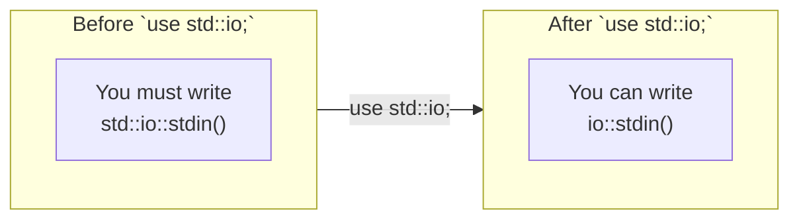
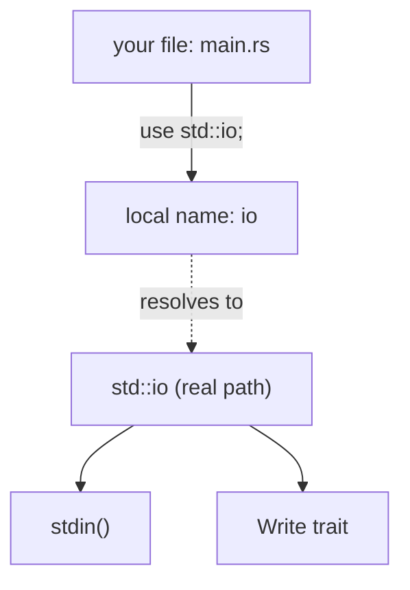

# The `use` keyword

`use` does **one thing**: it creates a shorter name (an *alias*) for a path that already exists. It does **not** copy code, it does **not** "import" in the way Python `import` does, and it has **no runtime cost**.

## Without `use`

You can always use the full path:

```rust
fn main() {
    let mut input = std::string::String::new();
    std::io::stdin().read_line(&mut input).unwrap();
    std::io::stdout().flush().unwrap();
}
```

This works but is noisy.

## With `use`

```rust
use std::io;
use std::io::Write;     // brings the `Write` trait so `.flush()` is callable

fn main() {
    let mut input = String::new();      // String comes from the prelude
    io::stdin().read_line(&mut input).unwrap();
    io::stdout().flush().unwrap();
}
```

What changed:

- `use std::io;` — now `io` is a shortcut to `std::io` inside this file.
- `use std::io::Write;` — pulls the `Write` **trait** in. Methods of a trait are only callable if the trait is in scope, even if you don't mention its name in the code.

## Forms of `use`

```rust
use std::io;                        // bring a module
use std::io::Read;                  // bring a single item
use std::io::{Read, Write};         // bring multiple from one path
use std::io::*;                     // bring everything (rarely a good idea)
use std::io::Result as IoResult;    // rename to avoid collision with std::result::Result
use std::collections::HashMap;      // bring a type
```

## What `use` is NOT

- It does not load or compile anything new. `std` is already linked into your binary.
- It does not "include" a file. Rust has no `#include`.
- It has zero runtime effect. The compiler resolves names at compile time.

## Scope rules

A `use` is scoped to the **module** it appears in. Writing `use std::io;` at the top of `main.rs` does not make `io` visible inside `src/utils.rs`. Each file (module) declares its own `use`s.

## Diagram — what `use` actually does





The local name `io` is just a pointer to the real path. Nothing is duplicated.

See next: [[03-prelude|The Prelude — items you get for free]]
