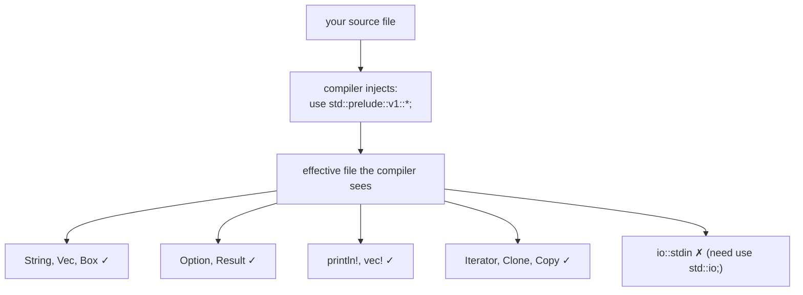

# The Prelude

The **prelude** is a small list of items that Rust automatically imports into **every file**, so you don't have to write `use std::...;` for the most common things.

Think of it as an invisible block of `use` statements the compiler silently adds to the top of your program.

## Why it exists

If there were no prelude, every `main.rs` would have to start like this:

```rust
use std::marker::{Copy, Send, Sized, Sync, Unpin};
use std::ops::{Drop, Fn, FnMut, FnOnce};
use std::mem::drop;
use std::boxed::Box;
use std::option::Option::{self, Some, None};
use std::result::Result::{self, Ok, Err};
use std::string::{String, ToString};
use std::vec::Vec;
use std::convert::{From, Into, TryFrom, TryInto};
use std::iter::{Iterator, IntoIterator, Extend, DoubleEndedIterator, ExactSizeIterator};
use std::default::Default;
use std::clone::Clone;
use std::cmp::{PartialEq, Eq, PartialOrd, Ord};
use std::hash::Hash;
use std::fmt::Debug;
// ... and more
```

That would be unbearable. So Rust ships these inside `std::prelude::v1` and inserts them for you.

## What's in it (selected)

| Item                                                 | Why it's there             |
| ---------------------------------------------------- | -------------------------- |
| `String`, `Vec<T>`, `Box<T>`                         | The most-used owned types  |
| `Option<T>` with `Some`, `None`                      | Nullability                |
| `Result<T, E>` with `Ok`, `Err`                      | Error handling             |
| `Iterator`, `IntoIterator`                           | So `for x in v` works      |
| `Clone`, `Copy`, `Default`                           | Common derivable traits    |
| `PartialEq`, `Eq`, `PartialOrd`, `Ord`               | Comparison                 |
| `Debug`                                              | So `{:?}` formatting works |
| `From`, `Into`, `TryFrom`, `TryInto`                 | Conversions                |
| `Drop`                                               | Destructor trait           |
| `Fn`, `FnMut`, `FnOnce`                              | Closure traits             |
| `drop(...)`                                          | Free a value early         |
| `print!`, `println!`, `eprintln!`, `vec!`, `format!` | Common macros              |

> **Note:** `io::stdin` is NOT in the prelude. That's why you write `use std::io;` to get it.

## Proof: the prelude is just `use` statements

The prelude is literally defined here in the standard library, and the compiler adds the equivalent of this to every file:

```rust
// roughly what gets injected at the top of every file
use std::prelude::v1::*;
```

You can opt out per-file with `#![no_implicit_prelude]`, but you almost never want to.

## Diagram — what the compiler does for you



## When you still need `use`

The prelude is intentionally **small**. You need an explicit `use` for anything beyond the basics:

```rust
use std::io;                      // not in prelude
use std::collections::HashMap;    // not in prelude
use std::fs::File;                // not in prelude
use std::thread;                  // not in prelude
```

Rule of thumb: if the item is something almost every program uses (`Vec`, `Option`, `println!`), it's in the prelude. If it's domain-specific (filesystem, networking, threads), you import it yourself.

## Other preludes

- `core::prelude` — same idea for `#![no_std]` code.
- Many libraries provide their own preludes you opt into, e.g.:
  ```rust
  use std::io::prelude::*;     // common io traits like Read, Write, BufRead
  use rayon::prelude::*;       // brings `par_iter()` etc. when using the rayon crate
  ```
  These are normal modules named `prelude` — they are **not** automatic. You have to `use` them.

See next: [[04-visualization|Visualizations of how it all fits together]]
