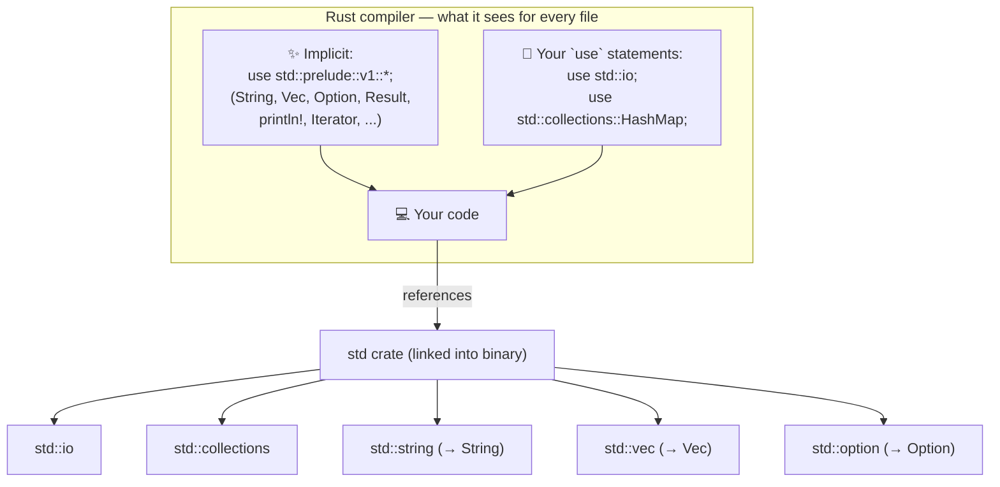
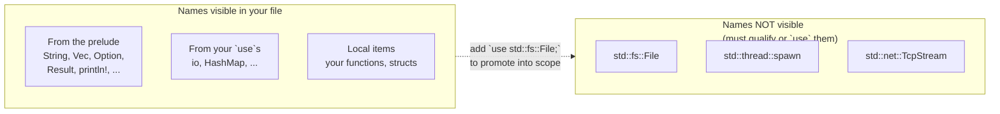

# Visualizations

Diagrams that tie [[01-standard-library|std]], [[02-use-keyword|use]], and [[03-prelude|the prelude]] together. Obsidian renders these Mermaid blocks automatically.

## 1. The big picture



## 2. Resolving a single line

What happens when you write `io::stdin()`?

```mermaid
sequenceDiagram
    participant You as Your code
    participant Compiler
    participant Std as std crate

    You->>Compiler: io::stdin()
    Compiler->>Compiler: Look up `io` in current scope
    Note over Compiler: Found via `use std::io;`<br/>→ resolves to std::io
    Compiler->>Std: std::io::stdin
    Std-->>Compiler: function pointer
    Compiler-->>You: compiled call
```

## 3. Scope: prelude vs. explicit `use`



## 4. A complete annotated example

```rust
// ─── implicit, added by the compiler ────────────────────────
// use std::prelude::v1::*;   ← this is why String, Vec, println! "just work"

// ─── your explicit imports ──────────────────────────────────
use std::io;                       // module shortcut
use std::io::Write;                // trait must be in scope to call .flush()
use std::collections::HashMap;     // a type from collections

fn main() {
    let mut name = String::new();              // String ← prelude
    print!("name? ");                          // print! ← prelude
    io::stdout().flush().unwrap();             // io ← your `use`, flush ← Write trait
    io::stdin().read_line(&mut name).unwrap(); // io ← your `use`

    let mut counts: HashMap<&str, i32> = HashMap::new();  // HashMap ← your `use`
    counts.insert("hello", 1);

    let v: Vec<i32> = vec![1, 2, 3];           // Vec, vec! ← prelude
    for n in v {                               // for needs IntoIterator ← prelude
        println!("{n}");                       // println! ← prelude
    }
}
```

Colour-coded mental model:

```mermaid
graph TD
    classDef prelude fill:#d4f4dd,stroke:#2a8c3c,color:#000
    classDef user fill:#dde7ff,stroke:#3858b3,color:#000
    classDef trait fill:#fff1cc,stroke:#b38600,color:#000

    String[String]:::prelude
    Vec[Vec]:::prelude
    vecm[vec!]:::prelude
    println[println!]:::prelude
    print[print!]:::prelude
    forloop[for ... in]:::prelude

    io[io module]:::user
    HashMap[HashMap]:::user

    Write[Write trait → enables .flush()]:::trait
```

- 🟢 **Green** = automatic (prelude)
- 🔵 **Blue** = you typed `use ...`
- 🟡 **Yellow** = a trait that must be in scope so its methods are callable

## 5. Mental model summary

```mermaid
mindmap
  root((Rust naming))
    std crate
      always linked
      organized into modules
        io, fs, collections, thread, ...
    use keyword
      creates local shortcut
      zero runtime cost
      scoped per module/file
      forms
        single item
        renamed (as)
        nested {A, B}
        glob *
    prelude
      auto-imported per file
      String, Vec, Option, Result
      println!, vec!, format!
      Iterator, Clone, Default
      opt out with no_implicit_prelude
      library preludes are manual
```

## Key takeaways

1. **`std` is always there** — it's the standard library crate, organized into modules.
2. **`use` is just a shortcut** — it renames a long path to a short one. No code is moved or duplicated.
3. **The prelude saves you from writing 20 boilerplate `use`s** in every file. It contains only universally-used items; anything else you import yourself.
4. **Traits must be in scope** to call their methods (that's why `use std::io::Write;` is needed for `.flush()`).

Back to [[README|index]].
