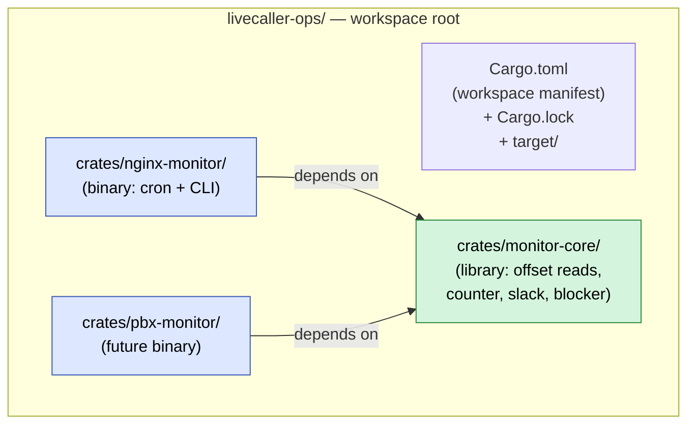
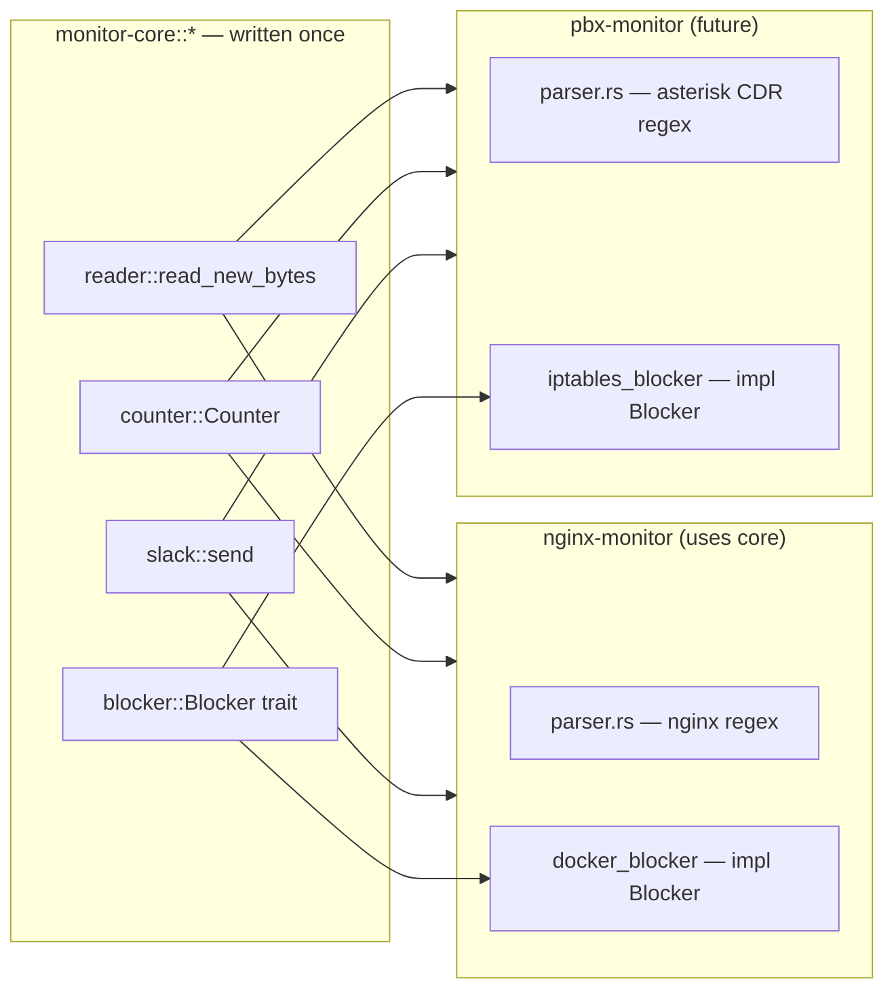

# Workspaces: many crates, one repo

A **Cargo workspace** is one top-level directory containing many Cargo crates that build together, share deps, and share a build cache. It's the right shape when you have:

- A shared library + multiple binaries that use it
- One repo with logically separate components
- A library you're testing with several example binaries

This is exactly what `nginx-monitor`, future `pbx-monitor`, and `microservice-monitor` would look like:



## The workspace manifest

Top-level `Cargo.toml`:

```toml
[workspace]
resolver = "2"
members = [
    "crates/monitor-core",
    "crates/nginx-monitor",
    # add new monitors here:
    # "crates/pbx-monitor",
]

# Versions pinned once, inherited by every member crate.
[workspace.dependencies]
anyhow     = "1"
serde      = { version = "1", features = ["derive"] }
serde_json = "1"
regex      = "1"

[workspace.package]
edition      = "2021"
rust-version = "1.70"
license      = "MIT"

[profile.release]
lto           = "thin"
strip         = "symbols"
panic         = "abort"
codegen-units = 1
```

Per-crate `Cargo.toml`s then inherit:

```toml
# crates/nginx-monitor/Cargo.toml
[package]
name    = "nginx-monitor"
edition = { workspace = true }
license = { workspace = true }

[[bin]]
name = "nginx-monitor"
path = "src/main.rs"

[dependencies]
monitor-core = { path = "../monitor-core" }
serde        = { workspace = true }
anyhow       = { workspace = true }
```

`{ workspace = true }` means "use the version pinned at the workspace root." Every member crate stays on the same `serde 1.0.X`, the same `anyhow`, etc.

## What the workspace gives you

| Property | Without workspace | With workspace |
|---|---|---|
| `serde` versions across crates | Drift independently per crate | Pinned in one place |
| `cargo build` artifacts | Each crate's own `target/` | One shared `target/` (cache hits across crates) |
| `cargo test` from root | Per-crate, manual | `cargo test --workspace` runs every crate's tests |
| `Cargo.lock` | One per crate | One at the workspace root |
| Cross-crate refactor | Edit-test-edit each crate separately | One IDE workspace, atomic changes |

## Useful workspace-aware commands

```sh
cargo build --workspace          # build every member
cargo build -p nginx-monitor     # build just one member (and its deps)
cargo test  --workspace          # test all
cargo test  -p monitor-core      # test just the library
cargo check -p nginx-monitor     # type-check just one (fast feedback)
```

`-p` ("package") is what you reach for most often. When you're working on the binary, `cargo check -p nginx-monitor` is the fast iteration loop.

## Adding a new member

```sh
# 1. Scaffold the crate
mkdir -p crates/pbx-monitor/src
cd       crates/pbx-monitor
cargo init --bin --vcs none .
cd ../..

# 2. Add to the workspace members list in root Cargo.toml
#    members = [..., "crates/pbx-monitor"]

# 3. In crates/pbx-monitor/Cargo.toml, depend on the shared lib:
#    [dependencies]
#    monitor-core = { path = "../monitor-core" }
```

That's it. Now `cargo build -p pbx-monitor` works and reuses `monitor-core`.

## Mental model



The bracketed work (parsing, blocking mechanism) is the only thing each new monitor adds. Reader, counter, slack are written once in `monitor-core` and reused.

## See also

- [[05-cargo-and-manifests|Cargo & Cargo.toml basics]]
- [[07-lib-vs-bin-crates|Library vs binary crates]]
- [[17-case-study-nginx-monitor|Case study: the nginx-monitor architecture]]
