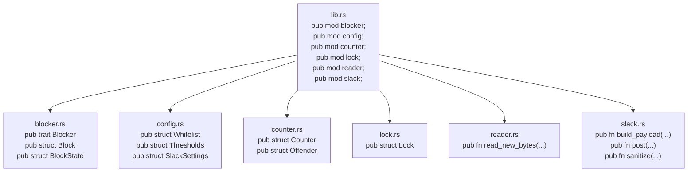

# Modules and visibility

A crate is a tree of **modules**. The root is `lib.rs` (for a library) or `main.rs` (for a binary). Each `mod foo;` declaration brings a child module into the tree.

## Declaring a module

Two ways:

**Inline** — the module's code lives right there in the file:

```rust
// in src/main.rs
mod parser {
    pub fn parse_line(s: &str) -> Option<&str> {
        // ...
    }
}

fn main() {
    parser::parse_line("hi");
}
```

**File-based** — the module lives in its own file:

```rust
// src/main.rs
mod parser;            // looks for src/parser.rs or src/parser/mod.rs

fn main() {
    parser::parse_line("hi");
}
```

```rust
// src/parser.rs
pub fn parse_line(s: &str) -> Option<&str> {
    // ...
}
```

Use inline for tiny helpers; file-based once a module grows beyond a screenful.

## Directory modules

When a module gets large enough to want its own submodules:

```
src/
├── lib.rs
└── parser/
    ├── mod.rs        ← the `parser` module itself
    ├── access.rs     ← becomes parser::access
    └── error.rs      ← becomes parser::error
```

```rust
// src/lib.rs
pub mod parser;

// src/parser/mod.rs
pub mod access;
pub mod error;

// Now callers can use:
//   crate::parser::access::parse_line(…)
//   crate::parser::error::parse_line(…)
```

Modern Rust also accepts `src/parser.rs` *plus* `src/parser/` directory next to it (no `mod.rs`). Either works.

## Visibility levels

| Modifier | Visible to |
|---|---|
| (none) | Just this module |
| `pub(super)` | The parent module |
| `pub(crate)` | Anywhere in this crate (lib + all bins) |
| `pub(in path::to::mod)` | Anywhere inside `path::to::mod` |
| `pub` | Everyone, including other crates that depend on this one |

```rust
pub struct Block { … }                  // exported to other crates
pub(crate) fn internal_helper() { … }   // visible across this crate only
fn really_private() { … }               // only this file
```

A common pattern: structs are `pub` because callers need to construct them, but private fields keep invariants intact:

```rust
pub struct Whitelist {
    set: HashSet<Ipv4Addr>,   // private — only Whitelist methods can mutate
}

impl Whitelist {
    pub fn from_raw(raw: &Value) -> Result<Self> { … }   // controlled constructor
    pub fn contains(&self, ip: &Ipv4Addr) -> bool { … }  // controlled reader
}
```

Outside callers can't bypass `from_raw`'s validation by constructing a `Whitelist` themselves. See [[11-newtype-pattern]].

## Putting it together: how `monitor-core` is laid out



Every `pub mod` at the top of `lib.rs` exposes that submodule outside the crate. From `nginx-monitor`'s perspective:

```rust
use monitor_core::counter::Counter;
use monitor_core::blocker::{Block, BlockState, Blocker};
use monitor_core::reader::read_new_bytes;
```

## The `use` keyword in this context

Already covered in [[02-use-keyword]] — `use` brings items into your local scope so you don't have to fully qualify them. The same rules apply: `use foo::bar::Baz;` then refer to `Baz` directly.

## Reading the visibility of an existing crate

When learning a Rust codebase:

1. Open `lib.rs` (or `main.rs`).
2. Read every `pub mod ...;` line — that's the public surface.
3. Open each `pub mod`, read every `pub fn`, `pub struct`, `pub trait` — that's what callers can use.
4. Anything else (no `pub`) is private machinery you don't have to understand to use the crate.

A small `lib.rs` is a sign of a well-organised crate: it tells you exactly which doors are open.

## See also

- [[02-use-keyword|The `use` keyword]]
- [[06-workspaces]]
- [[07-lib-vs-bin-crates]]
- [[11-newtype-pattern|Newtype: private fields keeping invariants]]
