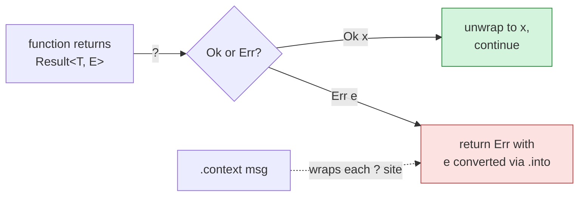

# Error handling: `Result`, `?`, `anyhow`, `Context`

Rust has no exceptions. Functions that can fail return `Result<T, E>` — either `Ok(value)` or `Err(error)`. The compiler forces you to handle both branches.

## `Result<T, E>`

```rust
enum Result<T, E> {
    Ok(T),
    Err(E),
}
```

Reading a file returns `Result<String, std::io::Error>`. Parsing an IP returns `Result<Ipv4Addr, std::net::AddrParseError>`. The error type is part of the function's contract.

## The `?` operator

Walking error returns up a chain manually is tedious:

```rust
fn read_offset(path: &Path) -> Result<u64, anyhow::Error> {
    let text = match fs::read_to_string(path) {
        Ok(t) => t,
        Err(e) => return Err(e.into()),
    };
    let n = match text.trim().parse::<u64>() {
        Ok(n) => n,
        Err(e) => return Err(e.into()),
    };
    Ok(n)
}
```

`?` collapses each "if Err, return; if Ok, unwrap" pattern into a single character:

```rust
fn read_offset(path: &Path) -> anyhow::Result<u64> {
    let text = fs::read_to_string(path)?;        // ? = early-return on Err
    let n = text.trim().parse::<u64>()?;
    Ok(n)
}
```

What `?` does mechanically:
- If the value is `Ok(x)` → evaluate to `x`, continue.
- If the value is `Err(e)` → return `Err(e.into())` from the enclosing function.

The `.into()` is why `?` is so seamless: it converts the inner error into whatever error type the function returns, as long as there's a `From` implementation.

## The pain `anyhow` solves

For a serious library, you'd define your own error enum with `thiserror`:

```rust
#[derive(thiserror::Error, Debug)]
pub enum ConfigError {
    #[error("config file unreadable: {0}")]
    ReadFailed(#[from] std::io::Error),
    #[error("invalid JSON: {0}")]
    BadJson(#[from] serde_json::Error),
    #[error("validation: {0}")]
    Invalid(String),
}
```

This gives callers structured error info they can `match` on. Right tool for a public library.

But for binaries — where errors usually end up being printed to stderr and the program exits — defining ten error enums is overkill. `anyhow` gives you a single dynamic error type that swallows anything:

```rust
use anyhow::{Result, Context};

fn load_config(path: &Path) -> Result<Config> {
    let text = std::fs::read_to_string(path)
        .with_context(|| format!("config not readable: {}", path.display()))?;
    let raw: RawConfig = serde_json::from_str(&text)
        .with_context(|| format!("invalid JSON in {}", path.display()))?;
    Ok(parse_validated(raw)?)
}
```

`anyhow::Result<T>` is just an alias for `Result<T, anyhow::Error>`. The `anyhow::Error` type can hold an `io::Error`, a `serde_json::Error`, or anything else — they all coerce via `?`.

## `.context()` and `.with_context()`

When an error bubbles up, you want to know what the program was trying to do. `.context()` attaches a layer of explanation:

```rust
let cfg = config::load(&path)
    .with_context(|| format!("loading config from {}", path.display()))?;
```

If `config::load` fails because the file doesn't exist, the user sees:

```
error: loading config from /etc/nginx-monitor/config.json

Caused by:
    0: config not readable: /etc/nginx-monitor/config.json
    1: No such file or directory (os error 2)
```

Each `.context(...)` call adds another "Caused by" layer. Use it liberally — every `?` is a candidate.

`.context()` takes a static string; `.with_context(|| ...)` takes a closure (only evaluated on error, so you can format expensive messages without paying when things succeed).

## `anyhow!` and `bail!`

For producing errors from scratch (not converting from another error type):

```rust
use anyhow::{anyhow, bail};

if ttl_min < 1 {
    bail!("ttl_min must be ≥ 1, got {ttl_min}");
}
// equivalent to:
//   return Err(anyhow!("ttl_min must be ≥ 1, got {ttl_min}"));
```

`bail!` returns immediately; `anyhow!` constructs the error without returning.

## A real example from `monitor-core`

```rust
pub fn read_new_bytes(log_path: &Path, state_dir: &Path) -> Result<Vec<u8>> {
    fs::create_dir_all(state_dir).ok();           // ignore failure — directory may exist
    let meta = match fs::metadata(log_path) {
        Ok(m) => m,
        Err(_) => return Ok(Vec::new()),          // missing log = silent no-op
    };
    let cur_inode = meta.ino();
    let cur_size = meta.size();

    // ... offset bookkeeping ...

    let mut f = File::open(log_path)?;            // ? bubbles up the io::Error
    f.seek(SeekFrom::Start(start))?;
    f.take(want as u64).read_to_end(&mut buf)?;
    Ok(buf)
}
```

Three patterns visible:
- `.ok()` — discard the `Result`, keep going. Used when failure is acceptable.
- `match` — distinguish two kinds of failure (missing file = no-op vs. real error).
- `?` — short-circuit on any other failure, returning up to the caller.

## Mental model



## Cheatsheet

| Need | Use |
|---|---|
| Return value or error | `Result<T, E>`, returned with `Ok(...)` / `Err(...)` |
| Propagate an error up | `the_call()?` |
| Add context to errors | `.context("...")?` or `.with_context(|| ...)?` |
| Create a new error | `anyhow!("...")` |
| Return a new error | `bail!("...")` |
| Best-effort ignore | `.ok()` (Result → Option) |
| Crash on error (only in `main` / tests) | `.unwrap()` or `.expect("...")` |
| Custom error enum | `thiserror::Error` derive |

## See also

- [[01-standard-library|Result is in std::result, re-exported in the prelude]]
- [[17-case-study-nginx-monitor|Where these patterns appear in our code]]
