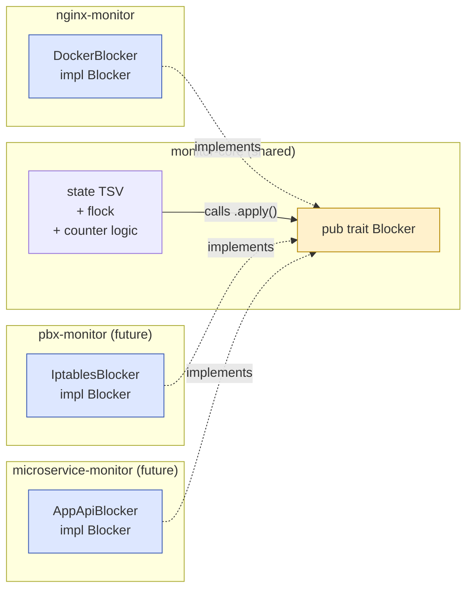

# Traits as seams: the `Blocker` pattern

A **trait** in Rust is a contract: "any type that implements me supports these methods." Like an interface in Java, an abstract class in C++, or a protocol in Swift — but with much stricter compile-time guarantees and zero runtime overhead by default.

## Declaring a trait

```rust
pub trait Blocker {
    fn apply(&self, blocks: &[Block]) -> Result<()>;
}
```

This says: any `Blocker` must provide an `apply(...)` method with this signature. Nothing else. Types that meet the contract are said to **implement** the trait.

## Implementing a trait

```rust
pub struct DockerBlocker {
    pub container: String,
    pub block_file: String,
    // ...
}

impl Blocker for DockerBlocker {
    fn apply(&self, blocks: &[Block]) -> Result<()> {
        // render `deny IP;` lines, push via docker exec,
        // validate with `nginx -t`, reload with `nginx -s reload`
        Ok(())
    }
}
```

The `impl Trait for Type { … }` block is how you connect a type to a trait. From now on, anywhere a `Blocker` is expected, `DockerBlocker` is accepted.

## Why we used it: the seam between shared and source-specific code

Our architecture:



`monitor-core` doesn't know — and can't know — *how* blocks are enforced. It just knows: "the operator will hand me something that does `.apply()`."

Each per-source binary picks its own enforcement mechanism:

| Binary | Implementation strategy |
|---|---|
| `nginx-monitor` | Push `deny IP;` into a conf file via `docker exec`, then `nginx -t && nginx -s reload` |
| `pbx-monitor` (future) | Build iptables rules, atomic-replace via `iptables-restore` |
| `microservice-monitor` (future) | POST to the service's `/admin/ban` endpoint |

The shared code just calls `blocker.apply(&blocks)`.

## Two ways to use a trait

### Static dispatch (generic)

The compiler stamps out a specialised version for each concrete type:

```rust
fn enforce<B: Blocker>(blocker: &B, blocks: &[Block]) -> Result<()> {
    blocker.apply(blocks)
}
```

Fast (no virtual call), but produces a separate compiled function per `B` type used.

### Dynamic dispatch (`dyn Trait`)

One function, virtual call at runtime:

```rust
fn enforce(blocker: &dyn Blocker, blocks: &[Block]) -> Result<()> {
    blocker.apply(blocks)
}
```

Slightly slower (one indirect call per invocation), but smaller binary if many implementations exist.

For our case we use the trait through concrete types directly — `DockerBlocker` is constructed in `nginx-monitor::block_ops` and `.apply()` is called on it. No `dyn` needed because we don't mix multiple blocker types at runtime.

## Trait methods can have default implementations

```rust
pub trait Greeter {
    fn name(&self) -> &str;
    fn greet(&self) {                          // default body — implementors can override
        println!("Hello, {}", self.name());
    }
}
```

`monitor-core::blocker::Blocker` doesn't use defaults (one required method), but they're useful for shared behaviour across implementations.

## Traits as type bounds

You can constrain generic types to "must implement X":

```rust
fn save<T: serde::Serialize>(value: &T) -> String {
    serde_json::to_string(value).unwrap()
}
```

`T: Serialize` means "T must implement `serde::Serialize`". The compiler checks this; if you try to pass a type that doesn't, you get a clear error at the call site.

## Common standard-library traits you'll see everywhere

| Trait | What it gives you |
|---|---|
| `Debug` | `{:?}` formatter (you write `println!("{:?}", x)`) |
| `Display` | `{}` formatter |
| `Clone` | `x.clone()` — explicit deep copy |
| `Copy` | `let y = x;` — implicit bit-copy (only for small types) |
| `PartialEq` / `Eq` | `==` and `!=` |
| `Ord` / `PartialOrd` | `<`, `>`, `.cmp(...)`, `.sort()` |
| `Hash` | usable as a `HashMap` key |
| `Default` | `T::default()` — gives a "zero value" |
| `From<T>` / `Into<T>` | conversions; `?` uses these |
| `Iterator` | `for x in iter`, `.map()`, `.filter()`, `.collect()` |
| `IntoIterator` | enables `for x in collection` |

Most can be auto-generated:

```rust
#[derive(Debug, Clone, Default, PartialEq, Eq)]
pub struct Block {
    pub ip: Ipv4Addr,
    pub expires_at: i64,
    pub source: String,
    pub reason: String,
}
```

`#[derive(...)]` is a compile-time code-gen that gives you implementations for free. Most types you write will have at least `Debug` derived; many will have `Clone` and `Default`.

## Trait objects vs generics — when to pick which

| | Generics (`fn f<T: Trait>(t: &T)`) | Trait objects (`fn f(t: &dyn Trait)`) |
|---|---|---|
| Dispatch | Static (compile-time) | Dynamic (runtime vtable) |
| Binary size | More code (one specialisation per T) | Less code |
| Speed | Fastest possible (inlinable) | One indirect call per method |
| Storage | Each `T` known at compile time | `Box<dyn Trait>` can hold any T at runtime |
| Use when | The set of types is small/static | You need a heterogeneous collection: `Vec<Box<dyn Trait>>` |

For `Blocker`: each binary has exactly one implementation. We use the concrete type (`DockerBlocker`). No `dyn`. Best performance, simplest code.

## See also

- [[09-error-handling-result-anyhow|.apply() returns Result — error handling]]
- [[11-newtype-pattern|Newtype: another way the type system protects invariants]]
- [[17-case-study-nginx-monitor|How Blocker fits into the wider architecture]]
