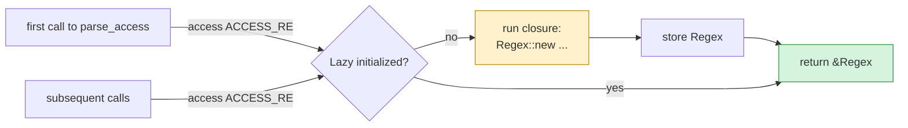

# Lazy statics with `once_cell::Lazy`

Some things you build *once* but use *many* times: a compiled regex, a parsed lookup table, a connection pool. In other languages you'd put them in a module-level variable. In Rust the compiler is strict about what can live at module scope — and that's where `once_cell::Lazy` comes in.

## The problem

A `Regex` value is built at runtime (it parses its pattern string into a state machine). You can't just write:

```rust
// won't compile
static ACCESS_RE: Regex = Regex::new(r"…").unwrap();
//                       ^^^^^^^^^^^^^^^^^^^^^^^
//                       "calls in statics are limited to constant functions"
```

Rust insists `static` items be initialised at compile time. `Regex::new` runs code, so it can't go there directly.

But constructing the regex on every call is wasteful:

```rust
fn parse(line: &str) -> Option<Hit> {
    let re = Regex::new(r"…").unwrap();   // ← compiles the regex EVERY call
    re.captures(line).map(|c| …)
}
```

For our nginx-monitor checker that hits this hot path ~5000 times per minute, that's pure overhead.

## The solution

```rust
use once_cell::sync::Lazy;
use regex::Regex;

static ACCESS_RE: Lazy<Regex> = Lazy::new(|| {
    Regex::new(
        r#"^(\S+) \S+ \S+ \[[^\]]+\] "(\S+) (\S+)[^"]*" (\d+) \d+ "[^"]*" "([^"]*)""#
    ).unwrap()
});

pub fn parse_access(line: &str) -> Option<AccessHit> {
    let caps = ACCESS_RE.captures(line)?;        // first call: builds regex; subsequent: zero cost
    // …
}
```

`Lazy<T>` holds either:
- A closure that produces a `T` (the initializer), or
- A `T` (once the initializer has run)

First access calls the closure, stores the result, and returns it. Every subsequent access just returns the stored value. Thread-safe under the `sync` variant.

## In `Cargo.toml`

```toml
[dependencies]
once_cell = "1"
```

A common crate that pulls in nothing extra. Tiny.

## Real usage in `nginx-monitor::parser`

```rust
static ACCESS_RE: Lazy<Regex> = Lazy::new(|| Regex::new(r#"…"#).unwrap());
static ERROR_LEVEL_RE: Lazy<Regex>  = Lazy::new(|| Regex::new(r"\[([a-z]+)\]").unwrap());
static ERROR_CLIENT_RE: Lazy<Regex> = Lazy::new(|| Regex::new(r"client: (\d+\.\d+\.\d+\.\d+)").unwrap());
```

Five regexes total. Compiled on first parse, then reused for the life of the process.

The `.unwrap()` is acceptable here because the regex literals are known correct at compile time — if they were wrong, every test run would crash immediately. (Some people prefer `static_regex!` macros that compile-check the pattern, but `once_cell` + `unwrap` is the convention.)

## When you'd use `OnceCell` instead

`Lazy<T>` knows how to initialize itself. `OnceCell<T>` does not — you set it explicitly at some point:

```rust
static CFG: OnceCell<Config> = OnceCell::new();

fn main() {
    CFG.set(load_config()).unwrap();    // initialize from real code (can fail)
    do_work();
}

fn do_work() {
    let cfg = CFG.get().unwrap();        // access from anywhere
}
```

Use `OnceCell` when the value can only be built once you know runtime parameters (like a CLI flag). Use `Lazy` when the construction has no inputs.

## Standard-library alternative (Rust 1.70+)

Rust 1.70 stabilized `std::sync::OnceLock` and `LazyLock` (the latter in 1.80). They're equivalent in spirit to `once_cell` but built-in:

```rust
use std::sync::LazyLock;
static ACCESS_RE: LazyLock<Regex> = LazyLock::new(|| Regex::new(…).unwrap());
```

Today, `once_cell` is still more common because of compatibility with older toolchains and a longer track record. If you're starting fresh and only need to support Rust 1.80+, the stdlib version is fine — one less dependency.

## Mental model



## Cheatsheet

| Need | Use |
|---|---|
| Regex compiled once, reused forever | `Lazy<Regex>` |
| Configuration loaded from disk, then read globally | `OnceCell<Config>` |
| Initialize with arguments and use immutably from many threads | `OnceCell` |
| Same, but pure stdlib on Rust 1.80+ | `LazyLock` / `OnceLock` |

## See also

- [[15-cross-compilation-musl|once_cell is one of the deps we needed for the static binary]]
- [[17-case-study-nginx-monitor|Where Lazy<Regex> appears in our parser]]
