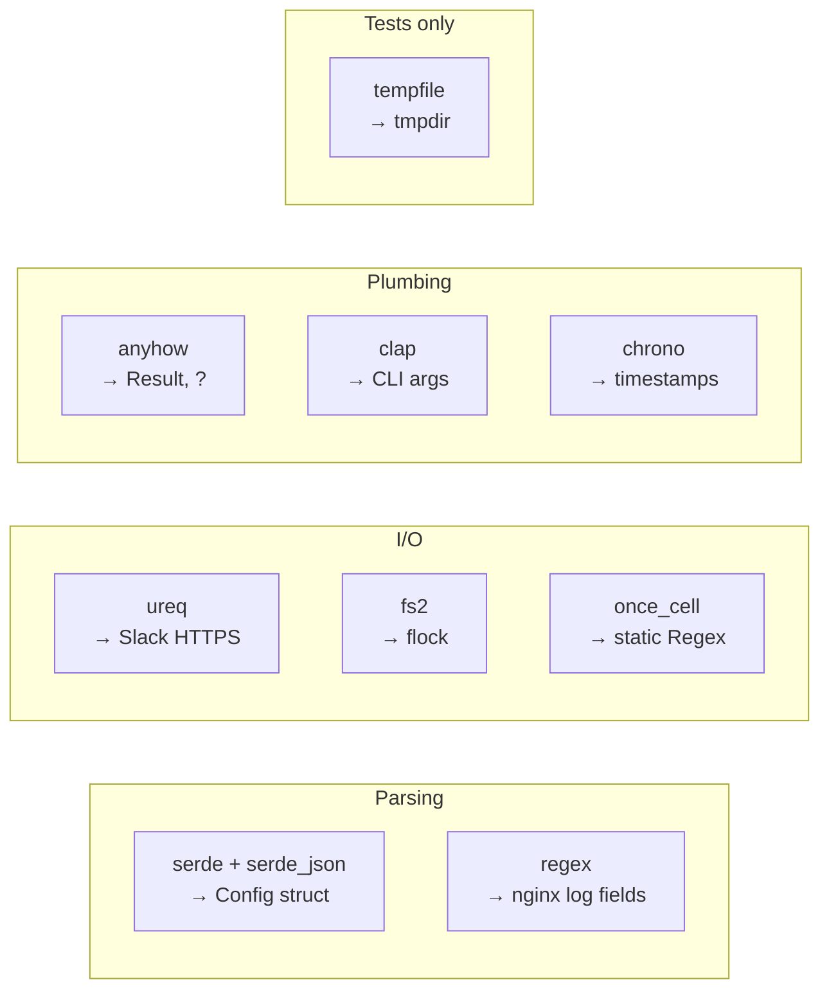

# The crates we used (and what each gives you)

The nginx-monitor workspace pulls in nine external crates. Each is a well-known, widely-used dependency — none are exotic. This is the "Rust toolbox" for an ops binary.

| Crate | Purpose | Where it's used |
|---|---|---|
| [`anyhow`](https://docs.rs/anyhow) | Ergonomic error handling | Every `Result<T>` return |
| [`serde`](https://docs.rs/serde) | (De)serialisation framework | Config struct definitions |
| [`serde_json`](https://docs.rs/serde_json) | JSON support for serde | Loading `abuse-monitor.json`, building Slack payload |
| [`regex`](https://docs.rs/regex) | Regular expressions | nginx log line parsing, config-value validation |
| [`ureq`](https://docs.rs/ureq) | Synchronous HTTP client | POST to Slack webhook |
| [`fs2`](https://docs.rs/fs2) | File-system extensions (flock) | `monitor-core::lock` |
| [`clap`](https://docs.rs/clap) | CLI argument parser | nginx-monitor subcommand dispatch |
| [`chrono`](https://docs.rs/chrono) | Date/time | "expires at" timestamps in block file |
| [`once_cell`](https://docs.rs/once_cell) | Lazy statics | Compile-once regexes |
| `tempfile` | Tempdir/tempfile for tests | dev-dependency only |

## `anyhow`

The ergonomic error type for binaries. Single `anyhow::Error` swallows any error type via `?`. `.context("…")` adds explanatory layers.

```rust
use anyhow::{Result, Context, bail};

fn load(path: &Path) -> Result<Config> {
    let text = fs::read_to_string(path)
        .with_context(|| format!("config not readable: {}", path.display()))?;
    if text.is_empty() {
        bail!("config is empty");
    }
    Ok(parse(text)?)
}
```

See [[09-error-handling-result-anyhow]].

## `serde` + `serde_json`

`serde` is the (de)serialisation *framework*; `serde_json` is one of its many backends. Together they turn JSON into typed Rust structs and back.

```rust
use serde::Deserialize;

#[derive(Deserialize)]
struct Raw {
    log_dir: Option<String>,
    #[serde(default)]
    slack_webhook_url: String,
    #[serde(default)]
    blocking: RawBlocking,
    #[serde(default)]
    logs: Vec<RawLog>,
}

let raw: Raw = serde_json::from_str(&text)?;
```

Key attributes:

| Attribute | Effect |
|---|---|
| `#[derive(Deserialize)]` | Auto-implement "construct me from JSON" |
| `#[derive(Serialize)]` | Auto-implement "render me to JSON" |
| `#[serde(default)]` | If the field is missing in input, use the type's `Default` |
| `#[serde(rename = "type")]` | Map a field with a Rust-reserved name (`type` is reserved) |
| `#[serde(transparent)]` | Skip the wrapper struct; treat as the inner type |

`#[derive(Deserialize)]` works on enums too, automatically mapping the variant name (or a `#[serde(rename = "…")]` override) to the JSON string.

## `regex`

Compiled regexes, capture groups, replacement. Used heavily in parsing:

```rust
static ACCESS_RE: Lazy<Regex> = Lazy::new(|| {
    Regex::new(r#"^(\S+) \S+ \S+ \[[^\]]+\] "(\S+) (\S+)[^"]*" (\d+) \d+ "[^"]*" "([^"]*)""#).unwrap()
});

let caps = ACCESS_RE.captures(line)?;
let ip = caps.get(1)?.as_str();
let status = caps.get(4)?.as_str();
```

`regex` defaults to safe linear-time matching (RE2-style), so log-injection can't blow up the parser. There's no backtracking, which is generally what you want for log scanners.

## `ureq`

A small, sync HTTP client. Picked over the more popular `reqwest` because:

| | `ureq` | `reqwest` |
|---|---|---|
| Sync API | Native | Through `blocking` feature |
| Async runtime | None | Tokio, full async by default |
| Binary size | ~1 MB | ~3–5 MB |
| Suitable for | CLI tools, ops scripts | Web services, complex clients |

For a cron tick that POSTs to Slack once, sync is plenty.

```rust
let resp = ureq::post(webhook_url)
    .set("Content-Type", "application/json")
    .timeout(Duration::from_secs(10))
    .send_string(&body);
```

## `fs2`

Filesystem extensions over std::fs. Used for `flock`:

```rust
use fs2::FileExt;

let f = OpenOptions::new().create(true).write(true).open(path)?;
f.lock_exclusive()?;        // blocks until lock acquired
// … critical section …
f.unlock()?;                // released on drop too
```

`std::fs::File` doesn't expose `flock`; `fs2` is the standard workaround. Tiny crate, zero deps.

## `clap`

The full-featured CLI parser. The `derive` feature is what we use:

```rust
use clap::{Parser, Subcommand};

#[derive(Parser, Debug)]
#[command(name = "nginx-monitor", version, about)]
struct Cli {
    #[arg(long, global = true)]
    config: Option<PathBuf>,

    #[command(subcommand)]
    cmd: Cmd,
}

#[derive(Subcommand, Debug)]
enum Cmd {
    Monitor,
    Block { ip: String, ttl_min: u32 },
    Unblock { ip: String },
    // …
}

fn main() {
    let cli = Cli::parse();
    // dispatch on cli.cmd
}
```

`clap` auto-generates `--help`, parses subcommands, validates types (`ttl_min: u32` means "must be a non-negative integer"). Everything else is just writing your Rust types.

## `chrono`

Date/time. We use it only for human-readable timestamp formatting:

```rust
let ts = chrono::Utc::now().format("%Y-%m-%d %H:%M:%S UTC");
let exp = DateTime::from_timestamp(b.expires_at, 0)
    .map(|d| d.format("%Y-%m-%d %H:%M:%S UTC").to_string());
```

Rust's stdlib has `SystemTime` but no formatting beyond debug output. `chrono` (or `time` — a more modern alternative) fills the gap.

## `once_cell`

Lazy-initialized statics. Used to compile regexes once. See [[12-lazy-statics-once-cell]].

## `tempfile` (dev-only)

In `[dev-dependencies]` only — never shipped in the binary:

```toml
[dev-dependencies]
tempfile = "3"
```

```rust
#[test]
fn rotation_resets_offset() {
    let dir = tempfile::tempdir().unwrap();
    // … use dir.path() …
    // dir is dropped at end of scope, directory is deleted
}
```

Used in unit tests that need a real filesystem.

## Mental model



All static-linked into the ~4 MB musl binary. No runtime deps.

## See also

- [[05-cargo-and-manifests|How these get into Cargo.toml]]
- [[14-cross-compilation-musl|All these crates bundle into the static binary]]
- [[17-case-study-nginx-monitor|How they fit together in the real code]]
