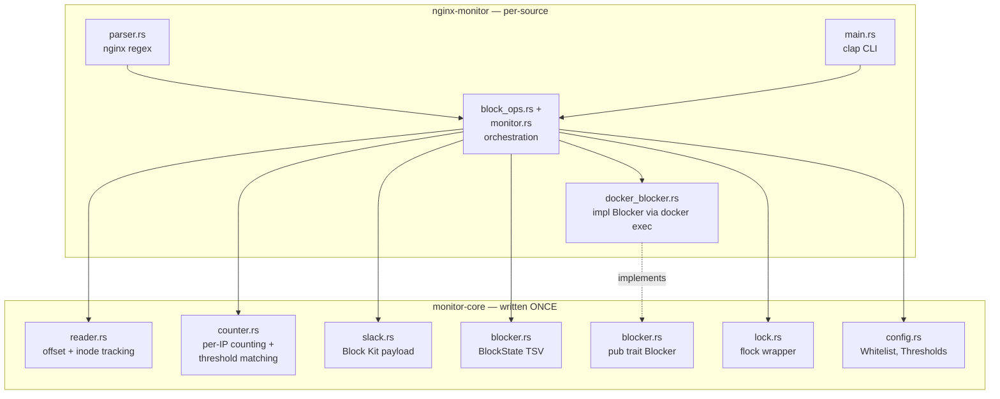

# Case study: the `nginx-monitor` architecture

This note ties everything together — the actual codebase we built. Use it as a reading guide if you want to walk through real Rust applying the patterns from the earlier notes.

Source: `/Users/giga/Developer/livecaller/livecaller-ops/`

## The problem in one sentence

A cron job, runs once a minute, that reads new bytes from a set of nginx logs, counts hits per IP per status class, posts Slack alerts on offenders, optionally injects `deny IP;` rules into the running nginx (in a Docker container) — and is reusable as a template for `pbx-monitor`, `microservice-monitor`, …

## File layout

```
livecaller-ops/
├── Cargo.toml                              ← workspace
├── .cargo/config.toml                      ← musl linker (macOS only)
├── crates/
│   ├── monitor-core/
│   │   ├── Cargo.toml
│   │   └── src/
│   │       ├── lib.rs                      pub mod everything
│   │       ├── reader.rs                   offset+inode log reads
│   │       ├── counter.rs                  per-(ip,key) histograms + threshold matching
│   │       ├── slack.rs                    block-kit payload + webhook POST + sanitiser
│   │       ├── blocker.rs                  BlockState (TSV) + Blocker trait
│   │       ├── config.rs                   Whitelist, Thresholds, SlackSettings types
│   │       └── lock.rs                     flock wrapper, RAII
│   └── nginx-monitor/
│       ├── Cargo.toml
│       ├── abuse-monitor.example.json
│       └── src/
│           ├── main.rs                     clap CLI, subcommand dispatch
│           ├── config.rs                   on-disk JSON schema + load()
│           ├── parser.rs                   nginx combined/error log regexes
│           ├── monitor.rs                  the cron tick: read → count → alert → block
│           ├── block_ops.rs                add / unblock / list / prune / materialize
│           └── docker_blocker.rs           impl Blocker via docker exec
└── archived/scripts/nginx/                 ← old bash, kept for reference
```

## The seam: shared vs source-specific



Future `pbx-monitor` and `microservice-monitor` would replace just `parser.rs` + `docker_blocker.rs` (with whatever enforcement makes sense). Everything in `monitor-core` is shared.

## Module-by-module tour

### `monitor-core::reader` — incremental log reads

The hard part of any tail-style log monitor: read only what's new, handle rotation and truncation. State per file is `<inode>:<byte_offset>` in `state/offset.<basename>`.

Algorithm:
1. `stat` the log → `(cur_inode, cur_size)`.
2. Read stored state. If missing, seed at EOF and return.
3. If `cur_inode != prev_inode` → file was rotated, reset offset to 0.
4. If `cur_size < prev_offset` → file was truncated, reset to 0.
5. Read bytes from `prev_offset` to `cur_size` (bounded — concurrent appends wait for next call).
6. Save new state.

Tested for: first-run-at-eof, second-run-reads-appended, rotation, truncation, no-new-bytes.

Patterns from previous notes: [[09-error-handling-result-anyhow|Result + ?]], [[13-inline-tests|#[cfg(test)] mod tests]].

### `monitor-core::counter` — threshold matching

`Counter` is a `HashMap<(Ipv4Addr, String), u32>`. The parser feeds it `(ip, "any")`, `(ip, "4xx")`, `(ip, "404")` for each access-log line; `(ip, "any")` for each error-log line.

After all lines are in, `find_offenders(thresholds)` walks the counts and emits one `Offender` per IP that crossed any threshold, listing which keys tripped.

Same logic runs for both alert thresholds and block thresholds — different `Thresholds` maps, same `Counter`.

Patterns: [[11-newtype-pattern|BTreeMap vs HashMap]] for deterministic ordering, [[13-inline-tests]] with five focused tests.

### `monitor-core::slack` — alert formatting

Builds a Slack Block Kit payload: one `header` block + one `section` block per offender + `divider` blocks between. Truncates each section to 2800 chars (Slack's 3000 max), caps total to 20 sections (Slack's 50 max). Sanitises mrkdwn link/code chars in user-controlled text.

Submitted via `ureq::post(...).send_string(&body)`.

Patterns: [[15-crates-we-used|ureq + serde_json::json!]], dry-run via empty webhook string.

### `monitor-core::blocker` — block state

`BlockState { blocks: Vec<Block> }` — in-memory image of `blocked-ips.tsv`. Methods:
- `load(path)` — parse TSV
- `save(path)` — write TSV (sanitising tabs/newlines)
- `merge(ip, expires, source, reason)` — idempotent insert (max expiry wins)
- `remove(ip)` — by IP
- `prune(now)` — drop rows with `expires_at <= now`
- `active(now)` — iterator of non-expired

Plus the **trait** that per-source crates implement:

```rust
pub trait Blocker {
    fn apply(&self, blocks: &[Block]) -> Result<()>;
}
```

See [[10-traits-the-blocker-pattern]].

### `monitor-core::lock` — RAII flock

```rust
pub struct Lock { file: File }

impl Lock {
    pub fn acquire(path: &Path) -> Result<Self> {
        let file = OpenOptions::new().create(true).write(true).truncate(false).open(path)?;
        file.lock_exclusive()?;
        Ok(Self { file })
    }
}

impl Drop for Lock {
    fn drop(&mut self) { let _ = self.file.unlock(); }
}
```

The `Drop` trait is how Rust does deterministic cleanup. When the `Lock` value goes out of scope (function returns, panic unwinds, …), `drop` is called automatically. Releases the flock without you having to remember.

This is the *RAII pattern* — Resource Acquisition Is Initialisation. Rust uses it everywhere: file handles close themselves, locks release themselves, memory is freed when ownership ends.

### `monitor-core::config` — common types

`Whitelist` (private `HashSet<Ipv4Addr>`, validated constructor), `Thresholds` (newtype around `BTreeMap<String, u32>`), `SlackSettings`. Generic across all monitors.

See [[11-newtype-pattern]].

### `nginx-monitor::parser` — nginx log regexes

`Lazy<Regex>` for each format. `parse_access` returns `Option<AccessHit>`; `parse_error` returns `Option<ErrorHit>`. Unparseable lines simply return `None` — silently skipped by the caller.

`status_keys_owned("404")` → `vec!["any", "4xx", "404"]` — the three keys the counter should increment for a 404 status.

See [[12-lazy-statics-once-cell]].

### `nginx-monitor::config` — JSON schema

`load(path)` reads the file via `serde_json`, validates every field that flows into a shell or docker command, returns a typed `Config`. Validation regexes for `docker_container`, `block_file`, shell commands, log filenames.

Two-phase: parse JSON into a `Raw…` struct with optional/default fields, then validate + normalize into the typed `Config`. The `Raw…` pattern keeps `serde` derive simple while the validation logic is explicit code.

### `nginx-monitor::docker_blocker` — `impl Blocker`

The enforcement mechanism for nginx:

1. Render `deny IP;` lines from `&[Block]` into a single string.
2. Hash the rendered content; skip docker round-trip if unchanged from last run.
3. `docker exec -i nginx sh -c "if [ -f X ]; then cp X X.prev; fi; cat > X"` — backup + write.
4. `docker exec nginx sh -c "nginx -t"` — validate.
5. On failure: revert backup, return error. On success: `nginx -s reload`.
6. Cleanup `.prev`, cache the content hash.

This is the only piece that knows about Docker. A future iptables-based `pbx-monitor` would have a parallel `IptablesBlocker` doing the same job differently.

### `nginx-monitor::monitor` — the cron tick

For each log entry in the config:

1. Read new bytes via `monitor_core::reader::read_new_bytes`.
2. For each line, parse via `parser::parse_{access,error}`. Skip whitelisted IPs. Observe `(ip, key)` into `Counter`.
3. `counter.find_offenders(&log.alert)` → alert-tripping IPs.
4. `counter.find_offenders(&log.block)` → block-tripping IPs.
5. For each alert offender: build a section. If also a block offender, call `block_ops::add(...)` and annotate the section.
6. `slack::post(...)` the payload.

Then prune expired blocks (`block_ops::prune`) and exit.

### `nginx-monitor::block_ops` — block CLI subcommands

`add`, `remove`, `list`, `prune`, `materialize`. Each one:

1. `Lock::acquire(...)` → exclusive lock on the state file.
2. Load state, mutate, save.
3. Build a `DockerBlocker`, call `.apply(...)` to push the new state to nginx.
4. (Lock released when the `Lock` value drops.)

### `nginx-monitor::main` — CLI dispatch

`clap` derive macro turns this into all the argument parsing:

```rust
#[derive(Subcommand)]
enum Cmd {
    Monitor,
    Block { ip: String, ttl_min: u32, … },
    Unblock { ip: String },
    List { #[arg(long)] expired: bool },
    Prune,
    Materialize,
}
```

`main()` parses, calls `config::load`, dispatches to the right helper in `monitor` or `block_ops`.

## Reading order if you're learning Rust

1. `monitor-core/src/lock.rs` (40 lines) — `Drop`, RAII, smallest file.
2. `monitor-core/src/config.rs` — newtype, serde derives, basic validation.
3. `monitor-core/src/blocker.rs` — plain structs, `Vec` manipulation, a trait.
4. `monitor-core/src/reader.rs` — file I/O, `Path`, `Result`, `?`.
5. `monitor-core/src/counter.rs` — `HashMap` with tuple keys, iterator chains, sorting.
6. `monitor-core/src/slack.rs` — `serde_json::json!` macro, HTTP via `ureq`.
7. `nginx-monitor/src/parser.rs` — regex + `once_cell::Lazy` + `Option`.
8. `nginx-monitor/src/config.rs` — two-phase Raw → typed Config pattern.
9. `nginx-monitor/src/docker_blocker.rs` — implementing a trait, `std::process::Command` with stdin.
10. `nginx-monitor/src/main.rs` — clap derive for CLI parsing.

Each file is small enough to read carefully in ~5 min. The whole `monitor-core` is ~600 lines.

## See also

- [[05-cargo-and-manifests]] [[06-workspaces]] [[07-lib-vs-bin-crates]]
- [[08-modules-and-visibility]] [[09-error-handling-result-anyhow]]
- [[10-traits-the-blocker-pattern]] [[11-newtype-pattern]]
- [[12-lazy-statics-once-cell]] [[13-inline-tests]]
- [[14-cross-compilation-musl]] [[15-crates-we-used]] [[16-cargo-cheatsheet]]
